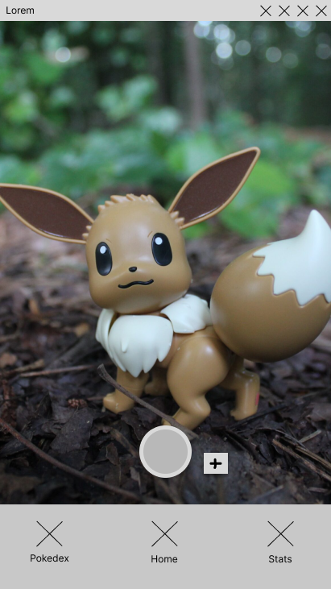
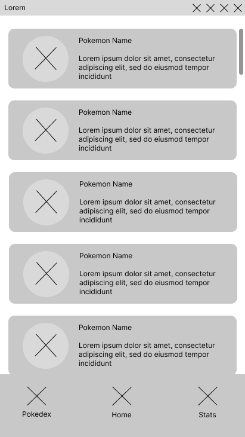
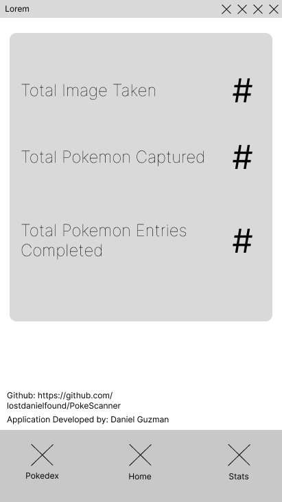

# PokeScanner
A real-life Pokedex that allows you to scan the area for Pkmn using your phone's camera. The application using A.I Object classification to detect to classify Pkmn within the 1st generation.

### Features

- [ ] Generation 1 Pkmn classification
- [ ] Pokedex Journel 
- [ ] Stats screen to view overall image captured

### Screens

- [ ] Home Menu - Starts off with the camera view being active. From here the user has the option to take a picture or move over to a different screen through the bottom nativation menu.

- [ ] Pokedex Journel - Should you all the pkmn that have been classified so far within the generation 1 pokedex. Should allow the user to access the `pkmn info screen` of a selected pkmn only if they have classified it by taking a picture of it.

- [ ] Pkmn info - A screen accessable through the Pokedex when a pkmn is selected, shows the various info of the pkmn such as pokedex #, pkmn name, species, and image of identification.

- [ ] Stats - Stats of using the application so far, how many pkmn you have captured, how many images you have taken, and total pkmn entries completed.

### Progress
#### **5/7/2024** 
Currently, the plans on how the user will interact with the application have been made. A database schemea
has been made to represent how the stateful data should be stored using the Room API in Kotlin. The next steps are to 
develop the UI that follows the ViewModel Arch, along with creating a Navigation interface between all screen. These screens
shouldn't operate and should only act as Views for the moment. 

### Made With

- Kotlin
- Tensorflow